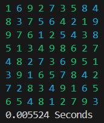

# Sudoku Solver

This is a small, animated Sudoku solving Python app I wrote for fun.



## Requires
- Python 3.10+
- Windows 10

## Install
```bash
python -m venv venv
source venv/Scripts/activate
pip install -r requirements.txt
```

## Usage

```
$ python sudoku.py --help
Usage: sudoku.py [OPTIONS] [PATHS]...

  Solve every puzzle in PATHS; if none are provided, solve an empty puzzle

Options:
  -a, --animate     To animate, or not to animate. If yes, extra frames are
                    renders and printed to the terminal.
  -t, --tick FLOAT  The amount of time, in seconds, that application will hold
                    after printing a frame.
  --help            Show this message and exit.
```

## Output

```bash
1 6 9 2 7 3 5 8 4
8 3 7 5 6 4 2 1 9
9 7 6 1 2 5 4 3 8
5 1 3 4 9 8 6 2 7
4 8 2 7 3 6 9 5 1
3 9 1 6 5 7 8 4 2
7 2 8 3 4 9 1 6 5
6 5 4 8 1 2 7 9 3
0.005524 Seconds
```

## Puzzle File Input Schema

A valid puzzle file is 9 lines long each with 9 characters. Valid characters are digits 0-9. The file must terminate in a new line.

`0` represents an empty cell.

### Example
```
003020600
900305001
001806400
008102900
700000008
006708200
002609500
800203009
005010300

```